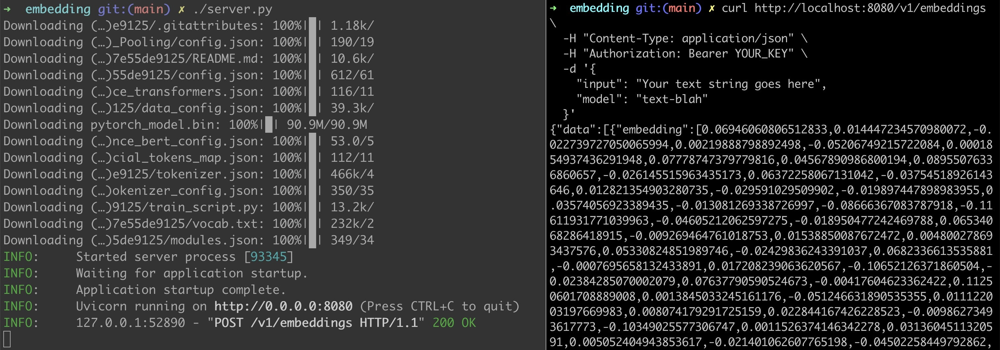

# Private Embedding Server API

Drop in replacement for OpenAI's embedding API. Can be used with official OpenAPI libraries. Written in python3

## Motivation

Embeddings supports modern day AI use cases for Classification, clustering, semantic Search & Recommendations. OpenAI and Huggingface api are great, however if you are concerned about privacy of your and your customers data, your data should not be leaked over to their api which may be used for purpose not defined by your privacy policy.

50 LOC



## Usage

```
import openai

openai.api_key = "MYKEY"
openai.api_base = "http://localhost:8080/v1"

embeddings = openai.Embedding.create(
    input="The food was delicious and the waiter...", model="all-MiniLM-L6-v2"
)

print(embeddings)
```

Also via CURL

```
curl http://localhost:8000/v1/embeddings \
  -H "Content-Type: application/json" \
  -H "Authorization: Bearer MYKEY" \
  -d '{
    "input": "Your text string goes here",
    "model": "all-MiniLM-L6-v2"
  }'
```

### Start Server

```
$ KEY=MYKEY ./embedding_server/server.py
```

Or using Uvicorn

```
$ MODEL=all-mpnet-base-v2 uvicorn 'embedding:app'
```

## Installation

poetry install

## Models

Supports model of your choice from https://www.sbert.net/docs/pretrained_models.html#sentence-embedding-models/ with environment varible MODEL

## Authentication

Supports shared key authentication (good enough for local usecases)

Dependecies

- sentence_transformers
- fastapi
- uvicorn

TODO:

- Unit testing
- Benchmark

### Notes:

The server will download the model data to cache on the first use. About 400mb depending on model in use

### Clearning Cache

rm -rf ~/.cache/torch
